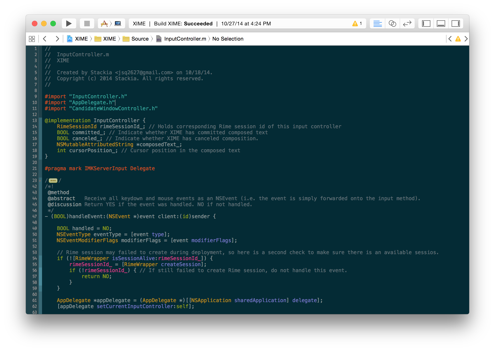
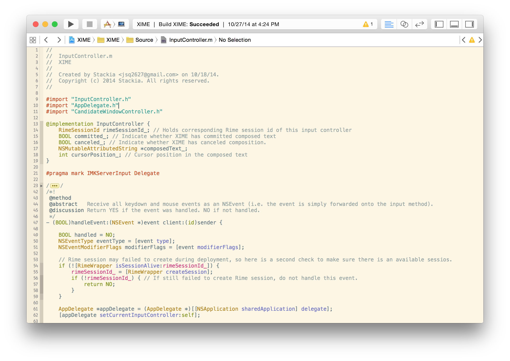

# Solarized Light & Dark Theme for Xcode
#### - Enjoy the world's most-popular theme for programming on Xcode



## Installation
> *Tested working on Xcode 12+*

1. Copy the two .xccolortheme files into `~/Library/Developer/Xcode/UserData/FontAndColorThemes`. You may have to create the directory if there isn't an existed one.
2. Restart your Xcode if it is running.
3. Select Solarized Light/Dark theme in your Xcode 'Preferences - Fonts & Colors (Tab)'.

Or run the following:
```bash
git clone git@github.com:stackia/solarized-xcode.git && solarized-xcode/install.sh
```

## See also
[The Official Homepage for Solarized Theme](http://ethanschoonover.com/solarized)
